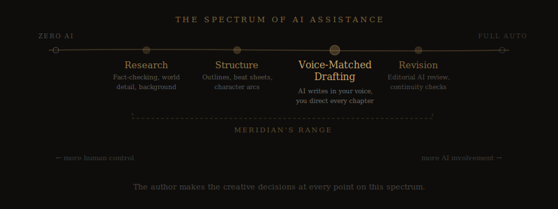

# Is It Okay to Use AI to Write Your Novel?

*The question every fiction writer is asking — and the honest answer from someone who builds AI writing tools for a living.*

---

I get this question more than any other. Usually it comes in some version of: "Am I cheating if I use AI to help write my book?" Sometimes it's more pointed: "Isn't this just plagiarism with extra steps?" And occasionally it's quieter, more personal — a writer who's been stuck for months, who found that an AI tool helped them break through, and who now feels guilty about it.

So let me answer it plainly, as someone who has spent the last year building [Meridian](https://meridianwrite.com/why-meridian/) — a professional novel pipeline that uses AI at every stage from voice analysis to revision.

**Yes, it's okay.** But the answer has nuance, and the nuance matters.

## The Question Behind the Question

When writers ask "is it okay to use AI," they're rarely asking about legality. Copyright law, for now, is clear enough: if you direct the creative process and make substantive decisions about the output, the work is yours. (More on the [legal specifics here](https://meridianwrite.com/faq/).)

What they're actually asking is something harder. They're asking: *Does this still count? Is this still mine? Am I still a writer if a machine helped me put the words on the page?*

That's a craft question. An identity question. And it deserves a thoughtful answer, not a dismissive one.

## The Tool Analogy (And Why It's Incomplete)

You'll hear people say "AI is just a tool, like a word processor or spell-check." That's partially true — AI is a tool. But it's a more powerful tool than a spell-checker, and pretending otherwise doesn't help anyone think clearly about it.

A spell-checker fixes your typos. A grammar tool smooths your syntax. An AI writing assistant can generate entire scenes, propose plot structures, and produce pages of prose in the time it takes you to make coffee.

That's a different category of assistance. It's not *wrong*, but it does mean the relationship between author and tool requires more intentionality than it used to.

The better analogy isn't spell-check. It's a developmental editor, a research assistant, and a very fast first-draft typist rolled into one. And nobody questions whether a novel is "really yours" because you worked with an editor.

## What Matters Is the Creative Direction

Here's where I land on this, after a year of building tools in this space and decades of writing fiction: **the author is the person who makes the creative decisions.**

Not the person who types every word. Not the person who manually researches every historical detail. Not the person who formats the manuscript. The person who decides what the story is about, who the characters are, what the narrative is doing at any given moment, and whether the output is good enough.

That's you. That has always been you. And if you're using AI as part of your process, it's still you — as long as you're the one steering.

The difference between an author using AI well and someone just clicking "generate" and publishing the result is the same difference between a filmmaker who directs every shot and someone who points a camera at a wall and hits record. The technology is identical. The creative involvement is worlds apart.

## The Spectrum of AI Assistance

It helps to think of AI writing assistance as a spectrum rather than a binary. On one end: zero AI involvement. On the other: fully automated, no human input. Most writers using AI fall somewhere in the middle, and where you fall says a lot about the nature of your finished work.

**Research and fact-checking.** Using AI to verify historical details, generate setting descriptions based on real geography, or compile background material. Almost nobody has a problem with this. It's the same work a research assistant would do.

**Structural planning.** Using AI to help you outline, build [beat sheets](https://meridianwrite.com/structural-planning/), map character arcs, or identify pacing problems before you start writing. This is high-value, low-controversy territory. The creative decisions — *which* structure, *which* arcs, *which* beats — are entirely yours.

**Voice-matched drafting.** This is where it gets interesting. Tools like Meridian that [analyze your existing prose](https://meridianwrite.com/voice-analysis/) and generate chapters that match your specific voice are doing something fundamentally different from tools that produce generic AI prose. The output sounds like you because the system *learned* you first. You're still the creative authority — but the first draft arrives faster.

**Revision and review.** Using AI as a [second pair of editorial eyes](https://meridianwrite.com/review-revision/) — checking for continuity errors, voice drift, pacing issues. This is what developmental editors do, and it's arguably *more* responsible than skipping editorial review entirely, which is what many self-published authors do for budget reasons.

**Full generation with no input.** Clicking a button and getting a book. This is the thing most people are actually worried about when they ask the question. And honestly? The output quality here is bad enough that the market will sort it out. Readers can tell. Reviewers can tell. The work doesn't hold up.

## Why I Built Meridian the Way I Did

When I designed [Meridian's pipeline](https://meridianwrite.com/), I made a specific choice: the author stays in the driver's seat at every stage.

You don't paste in a prompt and get a novel. You go through a guided intake process. You review and approve the outline. You approve each chapter individually. You can redirect the plot between chapters. You can regenerate anything that doesn't meet your standards, with notes about what specifically needs to change.

The system is designed so that the creative decisions — the ones that make a novel *yours* — never leave your hands. The AI handles the parts that don't require your unique creative judgment: maintaining [continuity across 80,000 words](https://meridianwrite.com/continuity-tracking/), keeping your [voice consistent](https://meridianwrite.com/voice-dna-profiling/) chapter to chapter, managing the sheer logistics of a long manuscript.

That division of labor isn't cheating. It's what professionals do.

## What About Traditional Publishing?

This is the practical question underneath the ethical one, and I want to be straightforward about it: publisher policies on AI-assisted work are evolving, and they vary. Some publishers are developing explicit disclosure requirements. Others haven't addressed it yet.

Meridian produces first drafts that require substantial human revision — the final manuscript reflects significant creative input from you. How you characterize that process in a submission is your decision, and I'd encourage you to make it honestly. (Our [FAQ covers this in more detail](https://meridianwrite.com/faq/).)

But here's the thing: the self-publishing world — which is where the majority of working fiction authors operate — has no such restrictions. And the readers buying those books care about one thing: *is this a good story, well told?*

## The Honest Truth

The writers who feel guilty about using AI are, in my experience, the ones who care the most about their craft. They're not looking for shortcuts. They're looking for leverage — a way to get past the blocks, maintain consistency across long projects, and produce better work than they could alone.

That instinct to question the tool, to ask whether you're still doing the real work, is a good instinct. Hold onto it. It's the thing that separates a writer who uses AI thoughtfully from someone who doesn't care about the output.

But don't let it paralyze you.

Every professional author in history has used tools to augment their process. Research assistants. Editors. Beta readers. Typists. Dictation software. Outline templates. Beat sheets developed by screenwriters and adapted for novels.

AI is the next tool in that lineage. It's more powerful than what came before, which means it requires more intentionality. But it doesn't change the fundamental equation: **the author is the person who cares about the story.**

If that's you, then yes — it's okay.

---

*[Meridian](https://meridianwrite.com/) is a professional novel pipeline built for serious fiction writers. Voice analysis, structural planning, chapter-by-chapter writing with continuity memory, and built-in editorial review — all designed to keep you in creative control. [See how it works →](https://meridianwrite.com/#pipeline)*
