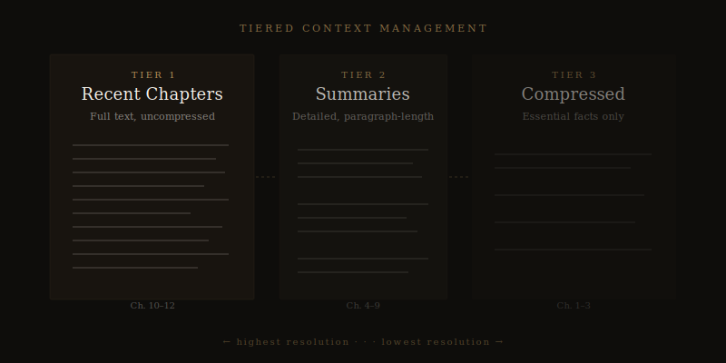

# Why Your AI Novel Forgets What Happened Three Chapters Ago

*The "context window" problem is the single biggest reason AI-generated novels fall apart — and fixing it is harder than you think.*

---

You're on chapter twelve. Your protagonist walked into the story with a scar on her left temple — you established it in chapter two, mentioned it again in chapter five. The AI just described her touching "the smooth skin of her forehead." No scar. No memory that it ever existed.

If you've used any AI writing tool for more than a few thousand words, you've seen this happen. A character's eye color changes. A dead character shows up alive. A timeline that worked perfectly through chapter eight suddenly contradicts itself in chapter nine.

This isn't a bug. It's the fundamental architecture of how large language models work — and understanding it will change how you think about AI-assisted novel writing.

## What a Context Window Actually Is

Every AI model has a context window — a fixed amount of text it can "see" at any one time. Think of it as the model's working memory. Anything inside that window, the model knows. Anything outside it might as well not exist.

Current models have context windows ranging from about 8,000 words to over 100,000 words. That sounds like a lot until you realize a standard novel is 80,000 to 100,000 words. And the context window doesn't just hold your manuscript — it also holds the system instructions, the prompt, any reference material, and the model's own output as it generates.

So when you ask an AI to write chapter twelve of your novel, it physically cannot hold the entire manuscript in memory. It has to work with a subset. And the question of *which* subset determines whether your novel holds together or falls apart.

## The Naive Approach (And Why It Fails)

The simplest approach — and the one most AI writing tools use — is to feed the model the most recent chapter or two, plus maybe a brief outline, and hope for the best.

This works for short stories. It works for the first few chapters of a novel. And then it starts to degrade.

By chapter ten, the model has no direct memory of what happened in chapters one through seven. It doesn't know that your protagonist's mother died in chapter three, unless you happened to mention it in the outline. It doesn't know that the gun introduced in chapter four needs to go off by chapter fifteen. It doesn't know that two characters had an argument in chapter six that should be coloring their interactions for the next fifty pages.

This is what I call **context amnesia**, and it's the single most common failure mode in AI-assisted long-form writing. The model isn't stupid — it's working with incomplete information.

## The Research That Drove Our Architecture

When I started building [Meridian](https://meridianwrite.com/why-meridian/), I spent weeks studying this problem before writing a single line of code. The research was sobering.

In one test of a well-known model generating a novel-length manuscript with only recent-chapter context, character consistency accuracy dropped to about 60% by the midpoint of the book. Six out of ten character details were wrong or contradictory. Not because the model was bad at writing — because it literally couldn't remember what it had written.

That finding shaped every architectural decision we made.

## How Meridian Solves It: Three Layers of Memory

Meridian uses a [tiered context management system](https://meridianwrite.com/tiered-context-management/) that gives the AI access to the entire novel's worth of information without trying to stuff 80,000 words into a single prompt. Here's how it works.

**Tier 1: Recent chapters in full.** The two or three most recent chapters are kept in complete, uncompressed form. The model can see every word, every dialogue beat, every description. This is where immediate continuity matters most — the reader just read these pages, and any contradiction will be obvious.

**Tier 2: Mid-range chapter summaries.** Chapters from the recent past — say, four through eight chapters back — are represented as detailed summaries. Not one-line loglines, but paragraph-length summaries that capture key events, character states, emotional beats, and any unresolved threads. The model knows what happened without needing to see every sentence.

**Tier 3: Compressed earlier chapters.** The earliest chapters are represented in highly compressed form — the essential facts, the foundational character and world details, the structural beats that the rest of the novel builds on.

This tiered approach means the model always has the full scope of your novel available, with the highest resolution focused on where it matters most: right now.

## The Documents That Never Forget

But tiered chapter summaries aren't enough on their own. Even a good summary can lose critical details — a character's physical description, a specific piece of world-building, a thematic thread that needs to pay off later.

That's why Meridian maintains [seven persistent documents](https://meridianwrite.com/seven-persistent-documents/) that accumulate information across the entire lifecycle of your novel and are injected into every single generation.

The most important of these is the [Novel Bible](https://meridianwrite.com/novel-bible/) — an authoritative record of every character, location, object, timeline event, and world rule in your story. When Meridian writes chapter twelve, it doesn't have to *remember* that your protagonist has a scar on her left temple. That fact is in the Novel Bible, and the Novel Bible is always in context.

The [Continuity Ledger](https://meridianwrite.com/continuity-tracking/) works alongside it, tracking the *current state* of every element in real time. Your protagonist's scar is in the Novel Bible. The fact that she's currently in Portland, carrying a stolen notebook, and hasn't slept in two days — that's in the Continuity Ledger. It updates after every chapter.

And the Open Threads Tracker monitors every unresolved narrative promise: every gun on every mantelpiece, every unanswered question, every subplot that needs resolution. When the model writes a new chapter, it knows not just what has happened, but what still needs to happen.

## Why This Is Harder Than It Sounds

If you're thinking "well, just keep a big document with all the important stuff" — you're right, in principle. But the execution is where most tools fail.

First, the documents have to be *automatically maintained*. If the author has to manually update a continuity bible after every chapter, they'll stop doing it by chapter five. The system has to extract the relevant information from each generated chapter and update the persistent documents without human intervention.

Second, the documents have to be *selectively injected*. You can't dump the entire Novel Bible into every prompt — it would consume too much of the context window. The system has to figure out which characters, locations, and facts are relevant to *this specific chapter* and include only those.

Third, the documents have to be *consistent with each other*. If the Novel Bible says a character has blue eyes but the Continuity Ledger records them as green (because of a generation error three chapters ago), the system needs to catch that before it propagates.

This is an engineering problem, not a writing problem. And it's the reason most AI writing tools produce novels that fall apart after chapter five — they simply don't have the architecture to maintain coherence at novel length.

## What You Can Do Right Now

Even if you're not using Meridian, there are things you can do to fight context amnesia in any AI writing workflow:

**Maintain a manual story bible.** Keep a running document with every character detail, location description, and timeline event. Paste the relevant sections into your prompt before each generation. Yes, it's tedious. It's also the difference between a coherent novel and a mess.

**Summarize each chapter after generation.** Before moving to the next chapter, write a 200-word summary of what just happened — key events, character states, emotional beats. Feed it into the next prompt. This is the manual version of Meridian's tiered context system.

**Track your open threads.** Every time you introduce a question, a subplot, or a Chekhov's gun, write it down. Check the list before each new chapter. This is the thing that separates novels that feel *intentional* from novels that feel like they're being made up as they go — because they are.

**Re-read before you generate.** Before starting a new chapter, re-read at least the previous two chapters yourself. You'll catch things the AI won't, and you'll be better equipped to give it useful direction.

## The Bigger Picture

The context window problem isn't going away. Models are getting larger context windows, yes — but novels are also getting the same generation treatment as short content, and "bigger window" doesn't automatically mean "better memory." A model with a million-token context window can still lose track of a detail buried 200 pages back if nothing in the architecture forces it to pay attention.

The solution isn't bigger windows. It's smarter architecture — systems that know what to remember, what to check, and what to surface at the right moment.

That's what [Meridian is built to do](https://meridianwrite.com/tiered-context-management/). And it's why, when you're on chapter twelve, your protagonist still has that scar.

---

*[Meridian](https://meridianwrite.com/) maintains seven persistent documents across your entire novel — Novel Bible, Continuity Ledger, Style Anchor, Chapter Summaries, Open Threads Tracker, Author Preference Log, and Full Chapter Archive. Nothing gets forgotten. [See how it works →](https://meridianwrite.com/seven-persistent-documents/)*
