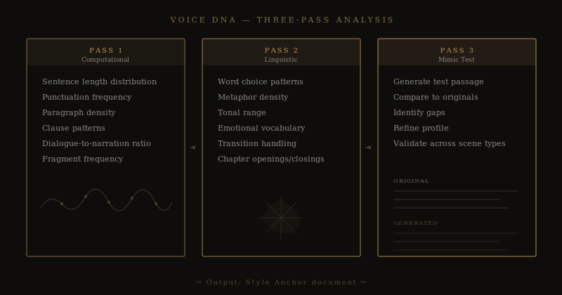

# Voice DNA: How to Make AI Write Like You (Not Like Everyone Else)

*Every writer has a fingerprint. Most AI tools ignore it. Here's why that's the root of the "AI slop" problem — and how voice profiling changes everything.*

---

You know the sound of AI writing. You've seen it in blog posts, in LinkedIn content, in those suspiciously polished Amazon listings. It has a tone — competent, smooth, slightly hollow. It reads like it was written by someone who has read a lot of books but has never had an original thought about any of them.

That's what happens when AI writes without a voice to anchor it. It defaults to the statistical average of everything it was trained on. And the statistical average of all published English prose is... bland. Correct. Lifeless.

This is the problem that made me build [voice analysis](https://meridianwrite.com/voice-analysis/) into the foundation of Meridian — not as a feature you turn on, but as the first step in the entire pipeline. Before the outline. Before the world-building. Before a single word of your novel is generated.

## What "Voice" Actually Means in Fiction

When writers talk about voice, they tend to gesture at something vague — "it's how your writing sounds," or "it's what makes your prose yours." True enough, but not useful if you want to teach a machine to replicate it.

Voice, when you break it down, is a collection of measurable patterns. Not all of them — there's an irreducible quality to great prose that resists quantification — but enough of them to make a meaningful difference in the output.

Here's what we mean by voice at a structural level:

**Sentence architecture.** Not just length — though average sentence length matters — but the *shape* of your sentences. Do you front-load your clauses or back-load them? Do you use fragments for emphasis? How often do you compound? Where do you put your commas relative to the rhythm of the thought?

**Paragraph density.** Some writers write long, dense paragraphs. Others write short, punchy ones. Some alternate between the two in patterns that create a specific reading rhythm. This isn't random — it's voice.

**Dialogue patterns.** How your characters speak is different from how your narrator speaks, and both are expressions of your voice. Do you use dialogue tags or action beats? How often? How much do your characters interrupt each other? How do you handle dialect?

**Emotional register.** When things get intense in your fiction, what changes? Some writers go shorter, more clipped. Others go longer, more flowing. Some strip out adjectives. Others pile them on. Your instinct in these moments is distinctive.

**Vocabulary tendencies.** Not just which words you use, but which words you *don't* use. Most writers have a working vocabulary that's much narrower than their reading vocabulary, and the specific subset they draw from is part of what makes them recognizable.

## Why "Write in the Style of X" Doesn't Work

You've probably tried prompting an AI with something like "write in the style of Hemingway" or "write in a literary fiction voice." The results are always the same: a caricature. Short sentences. Lots of "and." Obvious stylistic tics turned up to eleven.

That's because "write like Hemingway" tells the model to activate its *stereotype* of Hemingway, not to actually replicate the full complexity of his prose. It's like asking someone to do an impression of a famous person — you get the accent and the catchphrase, but not the actual person.

The same problem applies to "write in a literary voice" or "write in a thriller style." These are genre markers, not voice markers. They tell the model which shelf to reach for, not which specific book to open.

Voice profiling does something fundamentally different. It doesn't tell the model to write like a category. It teaches the model to write like *you*.

## How Meridian's Voice DNA Profiling Works

When you start a project in Meridian, the first thing the system asks for is your existing writing. Not a description of how you write — not "I write short, punchy sentences" — but actual samples of your prose. Chapters from a previous novel. Short stories. Whatever represents your real voice in action.

The system then runs a [multi-pass analysis](https://meridianwrite.com/voice-dna-profiling/) on those samples.

The first pass is computational: sentence length distributions, punctuation frequency, paragraph structure, clause patterns, dialogue-to-narration ratios. This produces a statistical profile of your prose at the mechanical level.

The second pass is linguistic: word choice patterns, metaphor density, tonal range, emotional vocabulary, how you handle transitions between scenes, how you open and close chapters. This is where the analysis moves from mechanics to style.

The third pass is a mimic test: the system attempts to generate a short passage in your voice based on what it's learned, then compares the result against your originals. Where does it match? Where does it fall short? The gaps inform the final profile.

The output of all three passes is a document we call the [Style Anchor](https://meridianwrite.com/style-anchor/) — a structured description of your voice across multiple dimensions, derived entirely from your own work.

## The Style Anchor: Your Voice as a Living Document

The Style Anchor isn't a prompt. It's not "write like this person." It's a detailed, structured reference that gets included in every generation the system makes — and it's used by both the Writer model (which generates your chapters) and the [Reviewer model](https://meridianwrite.com/multi-model-pipeline/) (which checks them).

Think of it like a style guide, but for your prose specifically. An editor working on your manuscript might keep notes: "This author tends to use sentence fragments for emotional emphasis," or "Dialogue is sparse and functional — no purple attributions." The Style Anchor is that set of notes, except it's derived from systematic analysis rather than editorial intuition, and it's referenced on every single page.

The result is that chapter one and chapter thirty-two sound like they were written by the same person — because they were, in the sense that matters. Your voice governed both.

## Scene-Type Variation: The Part Most Tools Miss

Here's something we discovered during development that I think is genuinely important: **your voice isn't constant.** You don't write action sequences the same way you write quiet reflective passages. You don't write dialogue-heavy scenes the same way you write descriptive ones. And you shouldn't — that variation is part of what makes your prose alive.

Most voice-matching approaches flatten this variation. They compute a single average profile and apply it everywhere. The result sounds consistent in the wrong way — like someone doing an impression of you that's technically accurate but emotionally dead.

Meridian's [scene-type aware styling](https://meridianwrite.com/scene-type-aware-styling/) handles this differently. The voice analysis segments your writing samples by scene type and builds separate profiles for each: action, dialogue, introspection, description, exposition. When the system writes an action chapter, it applies your *action voice*. When it writes a quiet, reflective chapter, it applies your *reflective voice*.

The variation isn't noise. It's signal. And preserving it is part of what makes the output feel like real writing instead of AI-generated text.

## What This Means for Your First Draft

Let me be clear about what voice profiling does and doesn't do.

It doesn't make the AI write as well as you at your best. On your best day, when everything is clicking and the prose is flowing and you're in that state where the words feel inevitable — no tool can match that. That's the human part, and it's why you still need to revise, edit, and make the final manuscript yours.

What it *does* do is raise the floor. Without voice profiling, AI-generated prose defaults to generic. With it, the output starts from a baseline that already sounds like your work. Your sentence rhythms. Your vocabulary. Your instinct for when to go long and when to cut short.

That means less revision. Less of the soul-crushing work of trying to edit generic AI prose into something that sounds like you wrote it. Less of the "I could have just written this myself from scratch" feeling that makes so many writers give up on AI tools entirely.

## The Honest Limitation

I'll say this because I think it matters: voice profiling isn't magic. It captures the structural and stylistic patterns of your writing, but there are dimensions of voice that resist quantification. Your specific sense of humor. Your thematic obsessions. The particular way you see the world.

Those things come from you, not from analysis. They come from the creative decisions you make as you review, direct, and revise the output. Voice profiling gets the AI 80% of the way there. The last 20% is still your job — and it's the most important 20%.

But 80% is a lot better than 0%. And that's the gap between a tool that knows your voice and one that doesn't.

## How to Get Started

If you want to use voice profiling effectively — whether with Meridian or with any other tool — here's what to prepare:

**Gather 10,000+ words of your best work.** Not your earliest work. Not your experimental work. The writing that sounds most like the author you are right now. Multiple pieces are better than one long one, because they give the analysis more variation to work with.

**Include different scene types.** Don't just submit dialogue-heavy chapters. Include action, description, introspection. The more variation in your samples, the more nuanced the profile.

**Choose work you're proud of.** The system learns from what you give it. If you feed it first drafts you know are weak, the profile will be weaker. Give it your best — that's the voice worth preserving.

The rest, [Meridian handles](https://meridianwrite.com/voice-analysis/). And the result — a novel that sounds like you wrote it, because your voice was the foundation of every sentence — is worth the fifteen minutes it takes to upload your samples.

---

*[Meridian's Voice DNA Profiling](https://meridianwrite.com/voice-dna-profiling/) analyzes your existing prose across multiple dimensions — sentence architecture, dialogue patterns, emotional register, vocabulary tendencies — and builds a Style Anchor that governs every chapter. [Learn how it works →](https://meridianwrite.com/voice-analysis/)*
