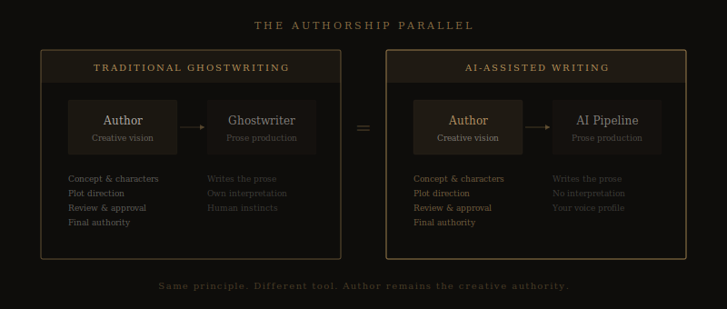

# The Ghostwriter Question: If AI Helps, Who's the Author?

*Ghostwriting has existed for centuries. AI changes the tool, not the principle — but the conversation is worth having honestly.*

---

James Patterson doesn't write his own books. Not entirely, anyway. He outlines them in detail — plot, structure, characters, beats — and a co-writer produces the prose. Patterson reviews, revises, and approves. The books sell under his name. Nobody calls this fraud.

Presidential memoirs are written by ghostwriters. Speeches are written by teams. Business books are outlined by the executive and drafted by a professional writer who captures their voice. The publishing industry has operated this way for as long as there's been a publishing industry.

So when someone asks me whether using AI to help write a novel makes them "not really the author," I think about Patterson. Because the question isn't new — only the technology is.

## The Division of Labor

Here's what a traditional ghostwriting arrangement looks like: the credited author provides the creative direction. The concept. The characters. The world. The emotional arc. The ghostwriter provides the prose — thousands of words shaped around the author's vision, in a voice that approximates the author's own.

Now here's what AI-assisted novel writing looks like, at least [the way Meridian approaches it](https://meridianwrite.com/why-meridian/): the author provides the creative direction. The concept. The characters. The world. The emotional arc. The AI produces prose shaped around the author's vision, in a voice derived from [the author's own writing](https://meridianwrite.com/voice-analysis/).

The structural parallel is hard to ignore. In both cases, the author is the creative intelligence directing the work. In both cases, someone (or something) else is doing a significant portion of the actual typing.

The difference? A ghostwriter is a human being with their own creative instincts, who brings their own interpretation to the material. An AI has no interpretation. It has no agenda. It generates exactly what it's instructed to generate, governed by [a profile of your specific voice](https://meridianwrite.com/voice-dna-profiling/), within a structure you've approved.

If anything, AI-assisted writing gives the credited author *more* control than traditional ghostwriting does.

## Why This Question Matters More to Fiction Writers

In nonfiction, ghostwriting is so common it barely registers. Everyone knows that most celebrity memoirs are ghostwritten. Most business books. Most political books. The ideas belong to the credited author; the prose is a production detail.

Fiction is different. Fiction writers identify with their sentences. The prose isn't just a delivery mechanism for ideas — it *is* the art. The way a paragraph unfolds, the rhythm of dialogue, the specific word chosen when three others would have worked — these things are what separate good fiction from great fiction.

So when a fiction writer considers using AI, the stakes feel higher. They're not outsourcing a production detail. They're outsourcing something that feels like the core of what they do.

I understand this concern. I'm a fiction writer myself. And I want to address it directly, because I think there's a meaningful distinction that gets lost in the anxiety.

## The Creative Decision vs. The Creative Output

Every novel involves thousands of decisions. What's the story about? Who are these people? What do they want? What's stopping them? How does the tension build? When does it break? Where does the prose go long and where does it go short? What's the emotional register of this scene versus that one? When does the reader learn the truth?

These are the decisions that make a novel *yours*. They're the decisions a reader is responding to, even if they couldn't articulate it. They're the reason two novels with identical premises can feel completely different.

The prose — the actual words on the page — is the *expression* of those decisions. It matters enormously. But it is not the only thing that matters, and it is not the thing that makes you the author.

You are the author because you made the decisions. Every one of them. From the initial concept through [the structural plan](https://meridianwrite.com/structural-planning/), through each [creative checkpoint](https://meridianwrite.com/chapter-writing/) where you approve, redirect, or reject what the AI has produced.

The question isn't "did you type every word?" The question is "did you direct this story?" And if the answer is yes — if you chose the characters, shaped the plot, set the emotional trajectory, reviewed every chapter, and revised until the work met your standards — then you're the author. Full stop.

## The Disclosure Question

This is where it gets practical. Even if you're comfortable with your own authorship, should you tell readers? Should you tell publishers?

My honest answer: it depends on context, and it's your call.

**Self-publishing.** There is currently no requirement to disclose AI assistance in self-published work. Your readers care about one thing: is this a good book? If you've used AI as part of a rigorous process — [voice-matched generation](https://meridianwrite.com/voice-dna-profiling/), [editorial review](https://meridianwrite.com/review-revision/), [continuity checking](https://meridianwrite.com/continuity-tracking/), and significant personal revision — the result is a book you directed and approved. The reader is getting what they paid for.

**Traditional publishing.** Publisher policies vary and are evolving. Some are developing explicit disclosure requirements. Others haven't addressed it. I'd recommend reviewing submission guidelines for any publisher you query, and being honest about your process if asked. (Our [FAQ covers this in more detail](https://meridianwrite.com/faq/).)

**Your own comfort level.** Some writers are completely open about their AI-assisted process. Others prefer not to discuss it. Both positions are defensible. What I'd caution against is active deception — claiming you hand-typed every word when you didn't. Not because you're legally obligated to disclose, but because honesty is a better long-term strategy than fabrication.

## The Real Concern (And Why I Take It Seriously)

When I strip away the philosophical layers, the real concern most writers have is simpler than authorship theory: *Is the work good enough?*

They worry that AI-assisted prose is detectable. That readers will know. That the work will feel hollow or generic or machine-made. That it won't have the quality their name deserves.

This is a legitimate concern, and it's the reason I built Meridian the way I did. Generic AI prose *is* detectable. It *does* feel hollow. A novel generated by prompting an AI with "write me a thriller" and hitting go will read like what it is — a machine doing its best impression of a thousand thrillers it's seen in its training data.

But that's not what a serious AI-assisted process produces. When the AI has [studied your specific voice](https://meridianwrite.com/voice-analysis/), when it's working within a [structure you designed](https://meridianwrite.com/structural-planning/), when it's maintaining [continuity across the full manuscript](https://meridianwrite.com/seven-persistent-documents/), when a [separate review model](https://meridianwrite.com/multi-model-pipeline/) is checking every chapter for quality before you ever see it — the output is categorically different.

It's not perfect. No first draft is. But it's a first draft that sounds like you, holds together structurally, and gives you something worth revising. That's what any good collaborator provides.

## Patterson, Revisited

James Patterson has sold over 300 million books. His name is on the cover. His creative vision drives every project. And he has openly, for decades, relied on co-writers to produce the prose.

Nobody questions his authorship. Because authorship has never been about who types the words. It's about who owns the creative vision and who takes responsibility for the result.

AI doesn't change that equation. It just gives more writers access to the kind of collaborative process that used to be reserved for people who could afford a team.

If you're directing the story, shaping the voice, making the decisions, and taking responsibility for the final manuscript — you're the author. The tool you used to get there is exactly that: a tool.

---

*[Meridian](https://meridianwrite.com/) keeps you in creative control at every stage — from voice analysis to structural planning to chapter-by-chapter approval. The AI writes. You direct. [See how it works →](https://meridianwrite.com/#pipeline)*
