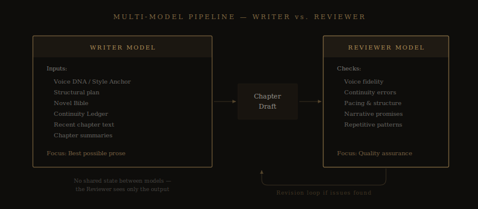

# Why One AI Model Isn't Enough to Write a Good Novel

*The single biggest quality mistake in AI-assisted writing is asking the same model to write and judge its own work. Here's what happens when you separate those jobs.*

---

Imagine hiring a contractor to renovate your kitchen, then asking that same contractor to inspect their own work and sign off on the building permit. You'd never do it. Not because the contractor is dishonest, but because self-review has a structural blind spot: the person who made the choices is the worst person to evaluate them.

This is exactly what every AI writing tool does when it uses one model for everything. The same system that generates your prose is asked to check for errors, evaluate quality, and catch its own mistakes. The result is predictable: the model is systematically blind to its own failure modes.

When I designed [Meridian's pipeline](https://meridianwrite.com/multi-model-pipeline/), this was one of the first architectural decisions I made — and one of the most important. Writing and reviewing are separate jobs. They need separate models.

## The Self-Review Problem

Large language models are remarkably good at generating fluent text. They are remarkably bad at evaluating whether that text accomplishes what it's supposed to accomplish.

This isn't a controversial claim. It's a well-documented property of how these models work. When a model generates a sentence, it's optimizing for the next most likely token given everything that came before. When you then ask that same model "is this sentence good?", it's evaluating its own output with the same biases that produced it.

In practice, this means:

**Voice drift goes undetected.** The model gradually shifts away from [your Style Anchor](https://meridianwrite.com/style-anchor/) over the course of a long generation. If you ask it to check its own voice fidelity, it evaluates the drifted voice as normal — because from its perspective, the current output is always coherent with what it just wrote.

**Pacing problems are invisible.** A model that just wrote three consecutive slow, introspective chapters doesn't flag the pacing issue because each chapter, individually, reads fine. The problem is structural — it exists across chapters, not within them — and the generating model has no incentive to surface it.

**Continuity errors slip through.** The model knows what it *intended* to write, which biases how it reads what it *actually* wrote. A character detail that contradicts an earlier chapter may not register because the model's attention is focused on local coherence, not manuscript-wide consistency.

**Repetitive patterns persist.** Models have favorite constructions — phrases, rhythms, transition patterns they default to. The generating model won't flag these because they're part of its natural output distribution. A second model, encountering the same text without having generated it, is much more likely to notice the repetition.

This is the fundamental problem. And no amount of prompt engineering — "now review your work carefully" — fixes it, because the review is still happening inside the same statistical framework that produced the output.

## How a Professional Author's Room Actually Works

The separation of writing and editing isn't something I invented for AI. It's how professional fiction has worked for a century.

An author writes a draft. An editor — a different person, with different sensibilities, different blind spots, different priorities — reads it. The editor catches things the author can't see because the editor didn't make the choices. They come to the text fresh, without the author's investment in any particular sentence or scene.

This is why developmental editing exists. Why copy editing exists. Why beta readers exist. The entire editorial infrastructure of publishing is built on a single insight: **the creator and the evaluator should be different entities.**

Meridian applies the same principle to AI. The Writer model and the [Reviewer model](https://meridianwrite.com/multi-model-pipeline/) are separate. They don't share state. The Reviewer has no knowledge of what the Writer "intended" — it only sees what the Writer produced. It reads the chapter the way an editor would: as a piece of text that needs to stand on its own merits.

## What the Writer Model Does

The Writer's job is singular: produce the best possible prose for this chapter, in this author's voice, given the full context of the story so far.

When the Writer generates a chapter, it has access to everything it needs: your [Voice DNA profile](https://meridianwrite.com/voice-dna-profiling/), the [structural plan](https://meridianwrite.com/structural-planning/), the [Novel Bible](https://meridianwrite.com/novel-bible/), the [Continuity Ledger](https://meridianwrite.com/continuity-tracking/), recent chapter text, and mid-range chapter summaries. Its entire focus is on serving the narrative — making this chapter the best version of itself.

This focus is valuable. You want the Writer to be fully invested in the creative act of generation. You don't want it distracted by self-evaluation, second-guessing its choices in real time. The best human writers don't edit while they draft for exactly this reason — it kills the momentum and produces stilted, over-cautious prose.

## What the Reviewer Model Does

The Reviewer reads the chapter after it's complete. It has a different set of instructions and a different perspective.

The Reviewer checks for:

**Voice fidelity.** Is this chapter consistent with [the Style Anchor](https://meridianwrite.com/style-anchor/)? Has the prose drifted toward generic patterns, or does it maintain the specific rhythms, vocabulary, and structural habits of the author's voice? The Reviewer uses the Style Anchor as an explicit rubric — not a vague guideline, but a measurable checklist.

**Continuity.** Does anything in this chapter contradict what's been established? Character details, timeline events, world rules, spatial relationships — the Reviewer cross-references against the [Continuity Ledger](https://meridianwrite.com/continuity-tracking/) and flags discrepancies.

**Pacing and structure.** Does this chapter serve its role in the larger narrative? Is it the right length? Does it advance the plot, develop character, and maintain momentum? Or does it stall, repeat beats from earlier chapters, or rush through material that deserves more space?

**Narrative promises.** Are open threads being acknowledged, advanced, or resolved appropriately? Is the chapter aware of what's been set up and what the reader is expecting?

When the Reviewer finds issues, it doesn't just flag them — it triggers revision. The chapter is adjusted before it ever reaches you. What you see is output that's already been stress-tested by a second perspective.

## Why This Is Different from "Check Your Work"

You might wonder: can't you just prompt a single model with "now review what you wrote and fix any issues"? In theory, yes. In practice, the results are dramatically worse.

I tested this extensively during development. Single-model self-review catches about 30-40% of the issues that a separate Reviewer model catches. The biggest gaps are in voice drift (the generating model almost never detects its own drift) and pacing (the generating model evaluates each chapter in isolation, not in the context of the surrounding chapters).

The reason is structural, not about model quality. It's the same reason you can't proofread your own work effectively: your brain fills in what it expects to see rather than what's actually there. A fresh pair of eyes — even artificial ones — sees the text as it is.

## What This Means for Your Novel

The practical impact of a multi-model pipeline is that quality is built into the process rather than bolted on afterward.

In a single-model workflow, quality control is your job. You read each chapter, catch the errors, fix the voice drift, notice the pacing issues, check the continuity. This is viable for a short story. For an 80,000-word novel with dozens of characters, locations, and plot threads, it's exhausting — and it's the reason many writers abandon AI tools partway through a long project.

In [Meridian's pipeline](https://meridianwrite.com/multi-model-pipeline/), the Reviewer handles the systematic quality checks. You still review the output — you're the final authority, always — but you're reviewing prose that's already been through an editorial pass. The obvious errors are gone. The voice is consistent. The continuity holds.

Your revision energy goes where it should: toward the creative decisions that only you can make. Not toward catching the same categories of mechanical errors across thirty chapters.

## The Broader Principle

The multi-model architecture reflects a broader principle that I think applies to any serious AI-assisted creative workflow: **specialization produces better results than generalization.**

A single model asked to do everything — research, outline, write, review, track continuity, maintain voice — will do all of those things adequately and none of them well. The cognitive load (if we can call it that) diffuses across too many objectives.

Separate models, each optimized for a specific task, with clear handoff points and defined responsibilities, produce categorically better output. It's the same reason a film crew has a director, a cinematographer, a sound engineer, and an editor rather than one person doing everything.

The output is the same artifact — your novel. But the process that produces it is more robust, more thorough, and more likely to catch the things that would otherwise make it to the reader.

And the reader, ultimately, is who you're doing this for.

---

*[Meridian's multi-model pipeline](https://meridianwrite.com/multi-model-pipeline/) separates writing from reviewing — so quality is built into every chapter before it reaches you. Combined with [Voice DNA profiling](https://meridianwrite.com/voice-dna-profiling/) and [seven persistent documents](https://meridianwrite.com/seven-persistent-documents/), it's the most thorough AI writing system available. [See how it works →](https://meridianwrite.com/#pipeline)*
